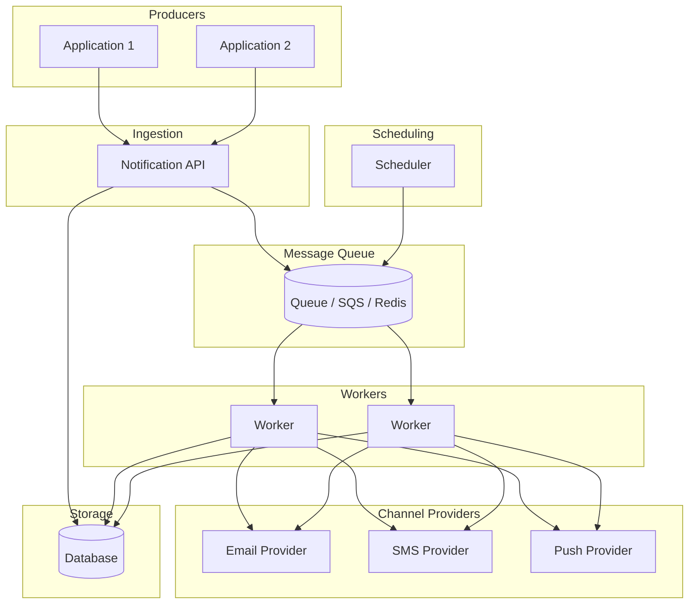
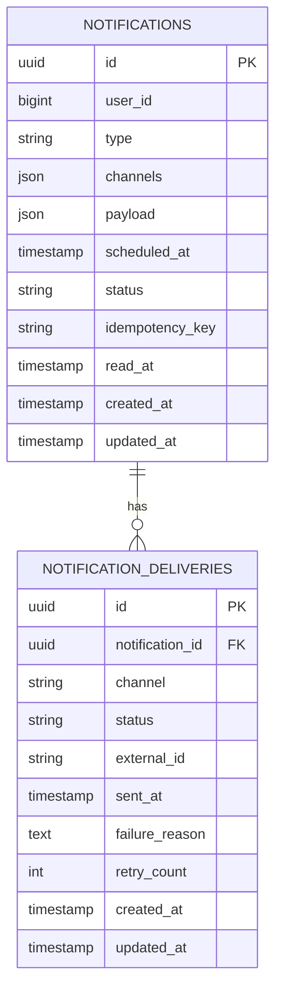

# SYSTEM_DESIGN.md

**Task 2: System Design** – Notification service (architecture, scalability, trade-offs).

This document presents a design for a notification service that could be implemented in any stack (e.g. Laravel, Node.js, Python) and could serve applications that requiring multi-channel notifications.

---

## A. Architecture Design

### A1. High-level system diagram

**Flow:** Producers (e.g. task management app) call the Notification API with immediate or scheduled requests. The API validates, persists metadata, and enqueues a job (or the Scheduler enqueues due jobs). Workers consume from the queue, load the notification and recipient, call each channel provider (email, SMS, push), and write in-app rows to the database. They update delivery status after each channel. The database stores notification metadata, scheduling intent, and per-channel delivery status.

### A2. Key components and their responsibilities

| Component | Responsibility |
| --------- | -------------- |
| **Notification API** | Accept create/schedule requests; validate payload and recipient; enqueue job or write to scheduler store; return notification ID for status tracking; expose GET status and optional list by user. |
| **Scheduler** | For "send at" time: either enqueue with queue delay (e.g. SQS message timer, Redis TTL) or a cron that queries due notifications and enqueues jobs. Keeps "when to send" separate from the API request path. |
| **Queue** | Decouple producers and workers; absorb traffic spikes; support retries and dead letter queue (DLQ). Durable so messages are not lost on worker crash. |
| **Worker(s)** | Dequeue job; load notification and recipient; for each channel (email, SMS, push, in-app), call the provider or write to DB; update delivery status; on failure, retry with backoff or send to DLQ. |
| **Delivery status store** | Persist per-channel status (pending, sent, failed, retrying) and timestamps. Enables "track delivery status" and "retry failed deliveries" flows; supports idempotency. |
| **Channel providers** | External: SendGrid/Resend (email), Twilio (SMS), FCM/OneSignal (push). In-app: own database table read by clients (poll or subscribe). |

### A3. Database schema design

**Entity relationship diagram**

**notifications** (core table)

| Column | Type | Description |
| ------ | ---- | ----------- |
| `id` | UUID / bigint | Primary key |
| `user_id` | UUID / bigint | Recipient (or tenant id) |
| `type` | VARCHAR | e.g. `task_reminder`, `payment_receipt` |
| `channels` | JSON / enum | `["email", "sms", "push", "in_app"]` |
| `payload` | JSON | `title`, `body`, `link`, etc. |
| `scheduled_at` | TIMESTAMP nullable | When to send; null = immediate |
| `status` | VARCHAR | `pending`, `processing`, `completed`, `failed` |
| `idempotency_key` | VARCHAR unique nullable | Avoid duplicate sends |
| `read_at` | TIMESTAMP nullable | When the user read it (for in-app); null = unread |
| `created_at` | TIMESTAMP | |
| `updated_at` | TIMESTAMP | |

**notification_deliveries** (per-channel tracking)

| Column | Type | Description |
| ------ | ---- | ----------- |
| `id` | UUID / bigint | Primary key |
| `notification_id` | FK → notifications | |
| `channel` | VARCHAR | `email`, `sms`, `push`, `in_app` |
| `status` | VARCHAR | `pending`, `sent`, `failed` |
| `external_id` | VARCHAR nullable | Provider message ID |
| `sent_at` | TIMESTAMP nullable | |
| `failure_reason` | TEXT nullable | |
| `retry_count` | INT default 0 | |
| `created_at` | TIMESTAMP | |
| `updated_at` | TIMESTAMP | |

**Indexes**

- `notifications`: `(user_id, created_at)` for listing by user; `(status, scheduled_at)` for scheduler; `(idempotency_key)` unique.
- `notification_deliveries`: `(notification_id, channel)` for lookup; `(status)` for "retry failed" queries.

The same concepts (notification, per-channel delivery) can be mapped to a NoSQL model too; see Trade-offs (C2).

### A4. Technology stack recommendations with justifications

| Layer | Recommendation | Justification |
| ----- | -------------- | -------------- |
| **API** | Any stateless stack (Node.js, Laravel, Python) | Stateless so it scales horizontally; only validates and enqueues, no heavy work in the request path. |
| **Queue** | Redis or AWS SQS | Durable; supports delay (Redis TTL or SQS message timer). SQS is fully managed; Redis is fast and simple to run. |
| **Workers** | Same language as API | Long-running processes that pull from queue and call providers; scale by adding worker instances. |
| **Database** | PostgreSQL or MySQL | Relational database fits notifications (user, status, channels); strong indexing for "due scheduled" and "failed to retry." |
| **Email** | SendGrid, Resend, or AWS SES | Deliverability and compliance (Sender Policy Framework); no need to run SMTP. |
| **SMS** | Twilio or AWS SNS | Reliability, global coverage; pay-per-use. |
| **Push Notifications** | Firebase Cloud Messaging(free) or OneSignal | Device token management and delivery handled by provider. |
| **Scheduling** | Queue delay or scheduler process | Avoids blocking the API; clear separation of "when to send" vs "send now." |

### A5. Reliability: retries, dead letter queue

- **Retries:** The worker catches provider errors (4xx/5xx, rate limits), retries with exponential backoff (e.g. 1 min, 5 min, 15 min), and enforces a max attempt count (e.g. 3–5). After each attempt, update `notification_deliveries.status` and `retry_count`.
- **Dead letter queue (DLQ):** After max retries, move the job to a DLQ (or mark the delivery as `failed` and optionally store in a `failed_notifications` table). A separate process or manual intervention can inspect, alert, or re-enqueue for retry.
- **At-least-once delivery concept:** Process the job once, then update status. If a worker crashes after sending but before updating, another worker may retry the same job; idempotency technique at the provider (or idempotency_key) prevents duplicate side effects.

---

## B. Scalability & Performance

### B1. Scale from 100K to 1M+ notifications per day

- **Queue:** Move from a single Redis instance to Redis Cluster or to AWS SQS.
- **Workers:** Add more worker instances through horizontal scaling.
- **Database:** Introduce read replicas for status and list APIs; keep writes on the primary.
- **Channels:** Use provider bulk or async APIs. Batch small payloads to reduce per-message overhead.
- **Rate limits:** Do not exceed the rate limits set by each provider. Use separate queues or throttling per provider to prevent other channel being blocked.

### B2. Traffic spike: 50K notifications in 5 minutes

- **Queue as buffer:** All requests are enqueued immediately; the API responds quickly with "accepted" and a notification ID. Workers drain the queue; the API layer never has to process 50K sends.
- **Auto-scaling workers:** Scale worker count based on queue depth (e.g. SQS metrics + Auto Scaling Group, or Kubernetes HPA). As depth increases, add workers; as it drains, scale down.
- **Provider limits:** Proactively throttle outbound calls to each provider (e.g. 100 req/s per provider) so the system does not get blocked; excess jobs remain in the queue and are processed as capacity allows.

### B3. High availability and fault tolerance

- **Stateless API and workers:** No in-memory state. Enables rolling deploys and replacement of failed instances without losing work.
- **Queue durability:** Use a durable queue (SQS, or Redis with AOF) to avoid messages are not lost on worker crash.
- **Database:** Use one primary instance for writes and one or more read replicas for reads. Regular backups and point-in-time recovery.
- **Multi-region:**  Use a global queue with regional workers.

---

## C. Trade-offs

### C1. In-house vs third-party (SendGrid, Twilio, AWS SNS)

- **Third-party (recommended):** Faster to ship; deliverability (email), compliance (SMS), and push notification infrastructure are handled by the provider; pay-per-use; less operational burden. Trade-off: vendor lock-in, cost at very high volume.
- **In-house:** Full control, custom logic. Trade-off: need to operate infrastructure by our own; responsible for deliverability and compliance; higher operational burden.
- **Recommendation:** Use third-party services for email, SMS, and push notification; build in-house only for the orchestration (API, queue, workers, delivery status database). This can help balances speed, cost, and reliability.

### C2. SQL vs NoSQL for this use case

- **SQL (recommended):** Notifications are structured table (user, type, status, channels); able to implement queries like "due scheduled," "failed by channel," and "list by user".
- **NoSQL:** A document store could hold notification payloads; a wide-column or time-series store could hold delivery events. Benefit: flexible schema, good for very high write volume and append-only logs. Trade-off: fewer ad-hoc queries, eventual consistency; more work to implement "retry failed" and reporting.
- **Recommendation:** Use SQL for core notifications and delivery status; consider NoSQL only for high-volume event logs (e.g. delivery events).

### C3. Synchronous vs asynchronous processing

- **Asynchronous (recommended):** The API enqueues and returns immediately; workers send in the background. Benefits: low API latency, handles spikes, retries and DLQ fit well. Trade-off: eventual consistency; the client must poll status or use webhooks to know when a notification was delivered.
- **Synchronous:** The API calls the provider and returns only after send. Benefits: simple, immediate feedback. Trade-off: API latency and fragility under load; provider latency or failure blocks the request; does not scale to 100K+/day in a single service.
- **Recommendation:** Use fully asynchronous processing for sending.
